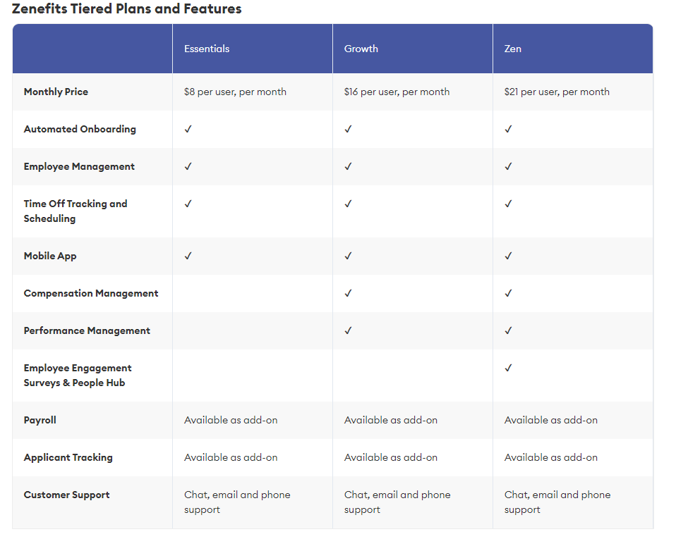

# Zenefits (TriNet) - AI integrated Human Resources Platform

## Opportunity
 •  Payroll - Currently still using QuickBooks as accounting software. With the rapid expansion of TechForge, we realise this platform is not suitable for this many people, being aimed at sole traders/small businesses. Payroll needs to be scalable for further expansion - also to allow company to get a better view on outflows. Luckily Zenefits allows integration with QuickBooks platform, so we should be able to transfer our existing data over fairly seamlessly.
  Also enables enables contractor payments and adheres to current tax filing practises for contracted employees if any are required.
 • Onboarding new employees has been slow, there is no structured training program or content to work through to get up to speed on basic security, fire drills, current relevant topics that team is working on. AI based automated onboarding
 • Applicant tracking - AI based applicant tracking software - allows to screen candidates effectively, reducing hands on time for HR.
 • PTO tracking/scheduling - improved management of employees can ensure we have the required skillsets available regardless of who is on annual leave, reducing downtime.
 • Mobile app for employees to check portal and also HR employees to manage if required input when away from desk.
 • Performance management platform - allows organisation in terms of hierarchy and performance reviews between managers and subordinates. Could probably be modified to integrate with the onboarding platform to use that as a learning/training platform for existing hires. Track what new training/skills are missing from employees to upskill and visualise promotion requirements.
 • Employee benefits management - self-service dashboard allwos employees to manage personal info, benefits,
 • Employee engagement surveys/people hub - centralised platform for messaging, collaboration and interaction with features related to zenefits. Surveys also allow tracking employee motivation/morale and anonymous feedback from employess in surveys

## Risk
 • What are the potential downsides - May require significant tweaking to fit specific needs and a lot of upfront time investment to transfer over current data/reimplement existing processes without losing data or affecting ongoing operations.
 • As with any external solution, there are potential security and privacy risks. Both in terms of what we store with Zenefits (e.g. sensitive employee information) and how they handle it. For example in 2016 an internal audit found Zenefits was out of compliance regarding their licensing (this was related to a previous venture in insurance services which the company no longer provides). Also Zenefits was acquired by TriNet in 2022 so change in business culture likely implemented to avoid compliance issues.
 • External company running HR related activities, potential if their platform goes down it has a knockon effect on us and we can't ctively fix it ourselves. at the mercy of their customer/tech support team. 
 • lack of customisation as limited control over the platform. 

## Tangible Benefit
Example Metrics to Consider:
 • Cost savings - consolidates majority of HR functions into single platform, rather than multiple disconnected solutions.
  Zenefits - $21/month per employee with the full Zen package and including payroll and applicant tracking addons ($6 each) = 33/month now at 250 employees, = $99,000 /year
 Avg HR Manager in US earns ~$80K according to https://www.indeed.com/career/human-resources-manager/salaries 
 up to ~$120k according to https://www.salary.com/research/salary/benchmark/human-resources-manager-salary 
 So an automated solution that probably adds more value than a single manual HR manager is excellent value for money.
 • Time efficiency.
 • Productivity gains.

## Evaluation
 • Does the benefit outweigh the risk - Funadmentally yes. The current system isn't up to scratch for a company this size, and while there are likely to be teething pains and a lot of upfront time and effort invested into the system, in the long run it will be of great benefit to the company.

 